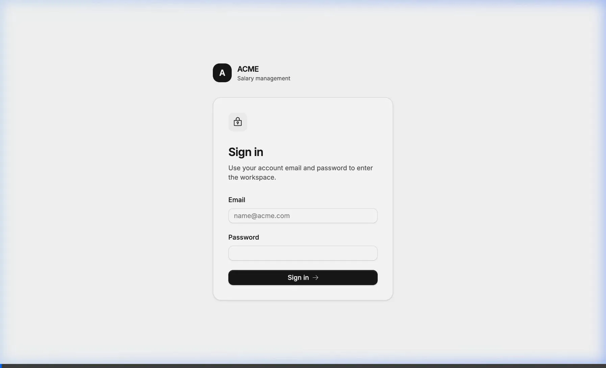
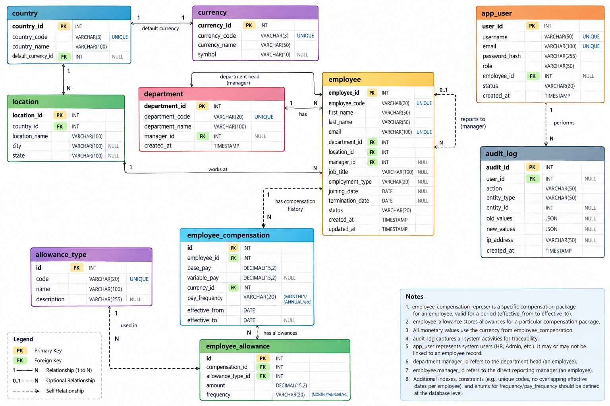

# ACME Salary Management

ACME Salary Management is a secure HR workspace for managing employee compensation across countries, departments, roles, and currencies. It helps HR teams search a large employee directory, inspect current and historical compensation, schedule salary changes, export auditable records, and understand organization-level compensation trends without relying on manual spreadsheets.

The product manages compensation commitments, not payroll execution. It does not calculate taxes, generate payslips, run bank transfers, or replace a full HRMS/payroll system.

## Live Demo

The application is deployed at:

https://acme-salary.up.railway.app

Use the following HR test credentials to sign in:

```text
User ID: hr@acme.com
Password: HrSecurePassword2026!
```

In seeded demo deployments, the bootstrap HR account is commonly configured through `AUTH_BOOTSTRAP_HR_EMAIL` and `AUTH_BOOTSTRAP_HR_PASSWORD`.

## Product Preview

The end-to-end walkthrough is included in the repository artifacts:



The walkthrough demonstrates the core HR flow:

1. Sign in as an HR user.
2. Search and filter the employee directory.
3. Open an employee profile.
4. Review current, scheduled, and historical compensation.
5. Create or schedule a compensation package.
6. Inspect analytics, administration data, and audit history.
7. Export auditable CSV snapshots.

## Core Capabilities

- **Authentication and access:** Email/password sign-in, short-lived JWT sessions, protected application routes, API authorization, visible user identity, and logout.
- **Employee directory:** Server-side search, filters, pagination, employee cards/tables, active filter state, CSV export, and empty/error/loading states.
- **Employee profiles:** Identity, employment details, as-of compensation, current package, scheduled package, compensation history, allowances, and recent activity.
- **Employee maintenance:** Create and edit employee records with validation and audit attribution.
- **Compensation package workflow:** Add first package or schedule a complete new package with effective dates, base pay, variable pay, allowances, reason, prior-package cutoff, and audit history.
- **Analytics:** Annualized salary metrics, distribution views, country/department/role breakdowns, compensation-change views, FX notes, exclusions, and CSV export.
- **Administration:** Allowance type management, read-only reference data for organization structure/currencies/FX, and administrative screens.
- **Audit trail:** Global and employee-scoped audit views with actor, action, target, timestamp, readable details, filters, and export events.

## Database Design

The application uses SQLite for persistence. Dates are stored as `YYYY-MM-DD`, timestamps are UTC, and monetary values are stored as integer minor units. For example, `125050` represents `1,250.50` for a currency with `decimal_places = 2`.



The main schema groups are:

| Area | Tables | Purpose |
|---|---|---|
| Reference data | `currency`, `fx_rate`, `country`, `location`, `department` | Supported currencies, approved FX rates, country defaults, work locations, and departments. |
| Employees | `employee` | Employee identity, organization placement, manager relationship, employment dates, and status. |
| Compensation | `employee_compensation`, `allowance_type`, `employee_allowance` | Effective-dated salary packages and package-level allowances. |
| Access | `app_user` | Application users, password hashes, roles, status, and optional employee linkage. |
| Audit | `audit_log` | Actor, action, entity, employee association, before/after values, outcome, reason, metadata, and timestamps. |

Important data-design choices:

- Employees can have multiple compensation packages over time.
- Compensation periods for the same employee cannot overlap.
- A package can include base pay, optional target variable pay, currency, pay frequency, effective dates, and allowances.
- Allowance types are configurable and can be activated or archived without losing historical package records.
- Reference records are protected by foreign keys and are not deleted while dependent data exists.
- Successful employee, compensation, export, and administration operations are written to the audit log.
- All application tables include `created_at` and `updated_at` timestamps.

For the source design note, see [artifacts/db-schema-design.md](artifacts/db-schema-design.md). The executable schema is in [backend/schema.sql](backend/schema.sql).

## Architecture

```text
frontend/   Vite, React, TypeScript, Tailwind, product UI components
backend/    FastAPI application, SQLite access, auth, APIs, audit, analytics
artifacts/  Requirements, product UX notes, DB diagram, walkthrough preview
specs/      Spec Kit feature plans, contracts, and task breakdowns
```

The production container builds the frontend first, copies the compiled static assets into the backend image, and serves the FastAPI API plus the single-page app from one Railway service.

## Local Setup

### Requirements

- Python 3.12
- Node.js 22 or compatible modern Node runtime
- npm

### Install Dependencies

```bash
python3.12 -m venv backend/.venv
backend/.venv/bin/python -m pip install -r backend/requirements.txt
npm --prefix frontend ci
```

### Configure Environment

The backend uses `backend/data/app.db` by default. For local development, create `backend/.env` and set at least:

```bash
JWT_SECRET_KEY=<random-secret-at-least-32-bytes>
JWT_ACCESS_MINUTES=30
AUTH_BOOTSTRAP_EMAIL=<admin-email>
AUTH_BOOTSTRAP_PASSWORD=<admin-password>
```

For Railway/demo-style startup, these variables are also supported:

```bash
AUTO_SEED=true
SEED_EMPLOYEES=10000
AUTH_BOOTSTRAP_HR_EMAIL=<hr-email>
AUTH_BOOTSTRAP_HR_PASSWORD=<hr-password>
DB_PATH=/data/app.db
```

When `AUTO_SEED=true`, startup can generate a synthetic 10,000-employee dataset if the database is empty.

### Initialize Database

```bash
backend/.venv/bin/python -m backend.init_db
```

Database initialization is safe to repeat. It creates or migrates the SQLite schema without removing existing users or audit records.

### Run Locally

Start the API:

```bash
backend/.venv/bin/uvicorn backend.main:app --reload --host 127.0.0.1 --port 8000
```

Start the frontend:

```bash
npm --prefix frontend run dev
```

Open the local URL printed by Vite. API documentation is available at:

http://127.0.0.1:8000/docs

## Deployment Setup

The app is configured for Railway using:

- [Dockerfile](Dockerfile)
- [railway.json](railway.json)
- [start.sh](start.sh)

Deployment flow:

1. Railway builds the Docker image from `Dockerfile`.
2. The Docker build runs `npm ci` and `npm run build` inside `frontend/`.
3. The built frontend files are copied into the Python runtime image.
4. Backend dependencies from `backend/requirements.txt` are installed.
5. `start.sh` initializes/migrates the SQLite database, optionally seeds demo data, optionally creates/updates the HR bootstrap account, and starts Uvicorn.
6. Uvicorn listens on Railway's `$PORT`.

Recommended Railway variables:

```bash
JWT_SECRET_KEY=<random-secret-at-least-32-bytes>
JWT_ACCESS_MINUTES=30
DB_PATH=/data/app.db
AUTO_SEED=true
SEED_EMPLOYEES=10000
AUTH_BOOTSTRAP_HR_EMAIL=<hr-login-email>
AUTH_BOOTSTRAP_HR_PASSWORD=<hr-login-password>
```

Use a Railway volume mounted at `/data` if the SQLite database should persist across redeploys.

## API Overview

Protected employee, compensation, analytics, administration, export, and audit endpoints require a valid `ADMIN` or `HR` JWT. `/api/health` remains public.

Common endpoints:

- `POST /auth/login` - sign in and receive an access token.
- `GET /auth/me` - resolve the active user.
- `GET /api/employees` - search and filter the employee directory.
- `POST /api/employees` - create an employee.
- `PATCH /api/employees/{employee_id}` - update employee details.
- `GET /api/employees/{employee_id}/compensation` - read as-of compensation context.
- `POST /api/employees/{employee_id}/compensation` - create a new compensation package.
- `GET /api/employees/export` - export filtered employee directory data.
- `GET /api/audit/events` - inspect global audit events.
- `GET /api/audit/events/export` - export audit history.

API contracts and feature notes live under [specs/](specs/).

## Testing

Run backend tests:

```bash
backend/.venv/bin/python -m unittest discover -s backend/tests -v
```

Run frontend checks:

```bash
npm --prefix frontend run build
npm --prefix frontend run lint
```

## Source Artifacts

The README is based on the assignment artifacts in [artifacts/](artifacts/):

- [requirements.md](artifacts/requirements.md) - product goal, scope, features, and deliberate exclusions.
- [product-ux-spec.md](artifacts/product-ux-spec.md) - UX flows, screens, product rules, and access expectations.
- [db-schema-design.md](artifacts/db-schema-design.md) - conceptual database schema.
- [acme-salary_db_design.png](artifacts/acme-salary_db_design.png) - database design diagram.
- [acme-salary-walkthrough.webp](artifacts/acme-salary-walkthrough.webp) - end-to-end product preview.
