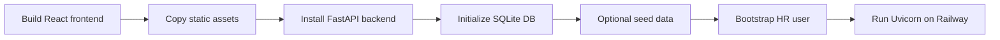

# Approach

I approached ACME Salary Management as a product-first build rather than starting directly with screens or APIs. The goal was to understand the salary-management domain, define a practical scope, design the data model, specify the UX, then implement and verify the product end to end.

## Build Flow

## 1. Research and Scope

I first researched how salary-management systems work and how they differ from payroll processing software. This clarified an important boundary: the product should manage compensation commitments, salary history, changes, analytics, exports, and auditability, but it should not execute payroll.

| Included | Not Included |
|---|---|
| Employee salary records | Payroll runs |
| Compensation history | Payslip generation |
| Salary changes and scheduling | Tax and deduction calculation |
| Allowances | Bank transfers |
| Analytics and exports | Full HRMS workflows |
| Audit trail | Employee self-service |

After that, I created a concise feature map to decide what to implement within the assignment timeline. I focused on the core HR workflow: sign in, find an employee, review compensation, make salary changes, inspect analytics, export records, and audit activity.

## 2. Data Modeling

I started the technical work with database design because salary-management systems depend heavily on historical accuracy. A single `salary` field on an employee would not be enough, so I modeled compensation as effective-dated packages.

The main schema decisions were:

- Employees have multiple compensation packages over time.
- Compensation packages have `effective_from` and optional `effective_to` dates.
- Overlapping compensation periods are blocked for the same employee.
- Monetary values are stored as integer minor units.
- Allowances are configurable through allowance types.
- Reference data such as currency, country, location, department, and FX rates is separated from employee data.
- Important changes and exports are captured in the audit log.

I iterated on the schema with an AI model, using it to review relationships, edge cases, constraints, auditability, and future extensibility. The design output is documented in `artifacts/db-schema-design.md`, while the implemented schema is in `backend/schema.sql`.

## 3. Product UX Spec

After the database design, I wrote a product UX specification to describe how the application should work from the HR user's point of view. This file defined the screens, flows, states, and product rules before implementation.

The UX spec covered:

- Employee directory behavior.
- Employee profile layout.
- Current, scheduled, and historical compensation display.
- Compensation-change flow.
- Analytics methodology and limitations.
- Audit-trail expectations.
- Deliberate exclusions from scope.

This gave the implementation a clear product target instead of letting the UI evolve randomly. The spec is available at `artifacts/product-ux-spec.md`.

## 4. Design System and Screen Direction

I created `design.md` to define the UI direction and component choices. It documented the interface style, typography, spacing, component patterns, Coss/shadcn-style UI usage, and Phosphor icon direction.

I then used Google's Stitch platform by feeding it the product UX spec and the design-system document. Stitch helped generate screen concepts, which I used as a visual handoff for implementation. Those screens, combined with the written spec, helped guide the frontend build through an MCP-assisted workflow.

## 5. Backend and APIs

The backend was built with FastAPI and SQLite. I implemented the foundation needed for the HR workflows before wiring the frontend deeply.

| Area | API Responsibility |
|---|---|
| Auth | Login, current user, JWT-protected APIs |
| Employees | Search, filters, pagination, create, edit, export |
| Compensation | As-of view, history, scheduled packages, package creation |
| Analytics | Salary metrics, breakdowns, distribution, exports |
| Administration | Allowance and reference-data views |
| Audit | Global and employee-scoped audit events |

This API layer allowed the frontend to work against real data rather than mocked screens.

## 6. AI-Assisted Development Workflow

I used GPT-based models throughout the project, from scaffolding to productionizing the app. The early implementation followed a spec-driven workflow: requirements, plans, API contracts, task breakdowns, implementation, and verification.

I also used a "GrillMe" style workflow to pressure-test unclear parts of the plan. This helped clean up vague decisions around compensation history, audit behavior, analytics definitions, and scope boundaries.

Later, I reduced the full spec-driven process because it was expensive to run and I had limited credits. I moved to a faster implementation loop: make a focused change, inspect it, test it where possible, and continue. That tradeoff helped me finish more of the product surface within the available time.

## 7. Frontend Implementation

The frontend was built with React, TypeScript, Vite, Tailwind, and reusable product/UI components.

Implemented screens include:

- Login
- Workspace shell and navigation
- Employee directory
- Employee profile
- Create/edit employee flows
- Compensation form
- Analytics
- Administration
- Audit trail

The frontend handles authenticated states, loading states, empty states, errors, filtering, navigation, and API-driven data display.

## 8. Browser-Based E2E Verification

For end-to-end verification, I used a Gemini Pro based Playwright MCP setup to automate browser testing. This allowed me to validate the product through the actual UI instead of only checking backend responses.

The browser verification covered flows such as:

- Opening the deployed/local application.
- Signing in as the HR user.
- Navigating through the workspace.
- Searching and filtering employees.
- Opening employee profiles.
- Reviewing compensation history.
- Checking analytics and administration screens.
- Verifying that core screens rendered correctly and interacted with the backend.

This step was useful because it tested the product in the way an HR user would actually experience it: through a browser, with frontend state, routing, authentication, API calls, and rendered UI all working together.

## 9. Demo Data and Deployment

To make the project demonstrable, I added seeded demo data. The seed process can generate 10,000 synthetic employees across countries, departments, roles, salary bands, compensation packages, and allowances.

The app is deployed on Railway:

https://acme-salary.up.railway.app

Deployment is handled through Docker and Railway:

## Tradeoffs

The main tradeoff was choosing breadth over depth. I wanted to demonstrate a complete salary-management workspace rather than overbuild one narrow workflow.

| Built | Deferred |
|---|---|
| Employee search and profiles | Full employee self-service |
| Effective-dated compensation | Formal approval workflows |
| Allowances | Payroll processing |
| Analytics | Advanced FX governance |
| Audit trail | Full user-management UI |
| Railway deployment | Bulk import workspace |

## Summary

The project moved through a deliberate pipeline: research, feature mapping, database design, AI-assisted review, UX specification, design system, screen generation, backend APIs, frontend implementation, browser-based e2e verification, and Railway deployment.

The final product is a focused salary-management application. It is not a payroll engine, but it demonstrates the core workflows an HR team would need to manage employee compensation, salary history, analytics, exports, and auditability.
