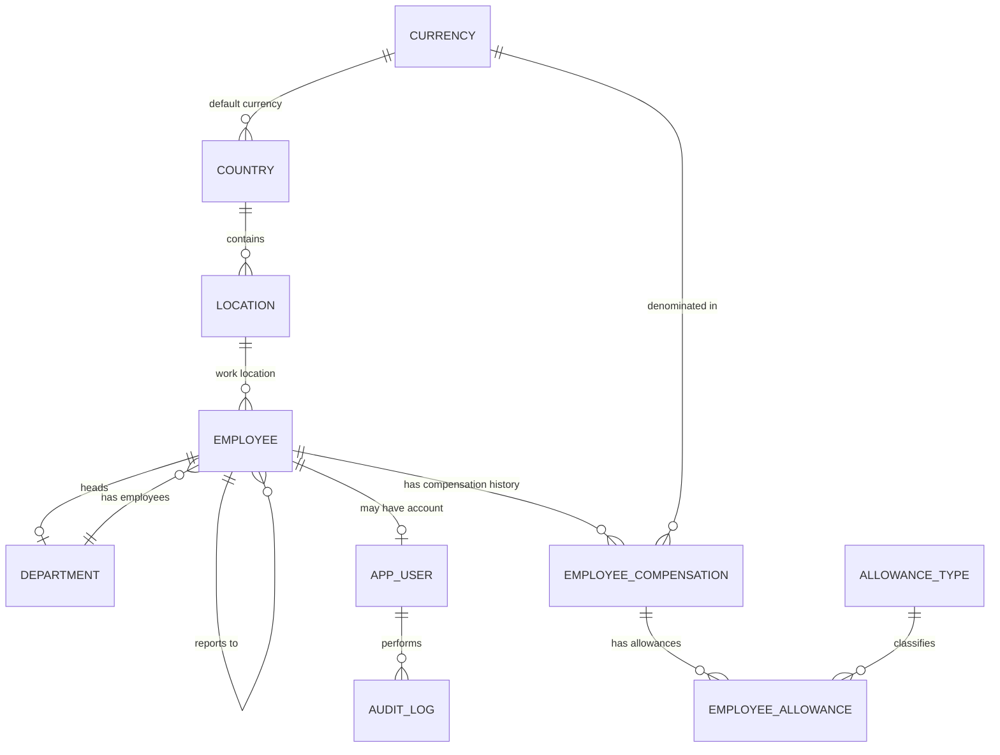

# Employee Salary Management — Database Schema Design

## 1. Currency

Stores supported currencies used across countries and compensation records.

```text
currency
--------
currency_id PK
currency_code UNIQUE
currency_name
symbol NULL
```

Example:

```text
1 | INR | Indian Rupee | ₹
2 | USD | US Dollar    | $
3 | GBP | Pound Sterling | £
```

---

## 2. Country

Stores supported countries and their default currencies.

```text
country
-------
country_id PK
country_code UNIQUE
country_name
default_currency_id FK -> currency.currency_id
```

### Relationship

```text
currency 1 ---- N country
```

---

## 3. Location

Represents employee work locations/offices within a country.

```text
location
--------
location_id PK
country_id FK -> country.country_id
location_name
city NULL
state NULL
```

### Relationship

```text
country 1 ---- N location
```

---

## 4. Department

Stores organization departments.

```text
department
----------
department_id PK
department_code UNIQUE
department_name
manager_id FK -> employee.employee_id NULL
created_at
```

`manager_id` represents the employee currently acting as the department head.

### Relationship

```text
department 1 ---- N employee
```

A department has one current department head, while an employee may or may not be a department head.

---

## 5. Employee

Stores the primary employee information.

```text
employee
--------
employee_id PK
employee_code UNIQUE

first_name
last_name
email UNIQUE

department_id FK -> department.department_id
location_id FK -> location.location_id

manager_id FK -> employee.employee_id NULL

job_title NULL
employment_type NULL

joining_date
termination_date NULL

status

created_at
updated_at
```

### Manager relationship

`manager_id` is a self-referencing foreign key representing the employee's direct reporting manager.

```text
employee N ---- 1 employee(manager)
```

This is separate from:

```text
department.manager_id
```

which represents the department head.

---

# Compensation

## 6. Employee Compensation

Represents a specific compensation package for an employee during a given period.

```text
employee_compensation
---------------------
id PK

employee_id FK -> employee.employee_id

base_pay
variable_pay NULL

currency_id FK -> currency.currency_id

pay_frequency

effective_from
effective_to NULL
```

Typical `pay_frequency` values:

```text
ANNUAL
MONTHLY
HOURLY
```

### Relationship

```text
employee 1 ---- N employee_compensation
```

An employee can therefore have multiple compensation records over time.

Example:

```text
EMP001

2025-04-01 → 2026-03-31
Base: ₹12,00,000

2026-04-01 → NULL
Base: ₹15,00,000
```

`effective_to = NULL` represents the currently active compensation package.

### Recommended constraints

```text
effective_to IS NULL
OR
effective_to >= effective_from
```

Compensation periods for the same employee should ideally not overlap.

---

## 7. Allowance Type

Defines the different allowance categories supported by the organization.

```text
allowance_type
--------------
id PK
code UNIQUE
name
description NULL
```

Example:

```text
MEAL
INTERNET
TRANSPORT
HOUSING
PHONE
```

This keeps allowance types configurable without requiring schema changes.

---

## 8. Employee Allowance

Stores the allowances belonging to a particular compensation package.

```text
employee_allowance
------------------
id PK

compensation_id FK -> employee_compensation.id
allowance_type_id FK -> allowance_type.id

amount
frequency
```

Example frequencies:

```text
MONTHLY
QUARTERLY
ANNUAL
ONE_TIME
```

### Relationships

```text
employee_compensation 1 ---- N employee_allowance

allowance_type 1 ---- N employee_allowance
```

Example compensation package:

```text
Employee Compensation
Base Pay       ₹15,00,000
Variable Pay   ₹1,50,000
Currency       INR

Allowances
├── Meal       ₹5,000 / month
├── Internet   ₹2,000 / month
└── Transport  ₹3,000 / month
```

The allowance currency is derived from the corresponding compensation record.

Therefore, `employee_allowance` does not require a separate `currency_id` for the current scope.

### Recommended constraint

```text
UNIQUE(compensation_id, allowance_type_id)
```

This prevents the same allowance type from accidentally being assigned multiple times within one compensation package.

---

# Application Users and Auditing

## 9. App User

Represents people who have access to the salary management application.

```text
app_user
--------
user_id PK

username UNIQUE
email UNIQUE

password_hash
role

employee_id FK -> employee.employee_id NULL

status
created_at
```

Application users and employees are intentionally separate concepts.

For example, users may include:

```text
HR Manager
HR Admin
Finance User
Auditor
System Administrator
```

An application user may optionally be linked to an employee record.

---

## 10. Audit Log

Provides system-wide traceability for important operations.

```text
audit_log
---------
audit_id PK

user_id FK -> app_user.user_id NULL

action
entity_type
entity_id NULL

old_values JSON NULL
new_values JSON NULL

ip_address NULL
created_at
```

Example actions:

```text
EMPLOYEE_CREATED
EMPLOYEE_UPDATED

DEPARTMENT_CREATED
DEPARTMENT_UPDATED

COMPENSATION_CREATED
COMPENSATION_UPDATED

ALLOWANCE_ADDED
ALLOWANCE_REMOVED

DATA_IMPORTED
DATA_EXPORTED
```

The audit log answers:

> Who changed what and when?

It is different from compensation history.

Compensation history is represented through effective-dated `employee_compensation` records.

---

# High-Level Relationship Diagram



---

# Entity Overview

```text
Reference / Master Data
-----------------------
currency
country
location
allowance_type


Organization Data
-----------------
department
employee


Compensation Data
-----------------
employee_compensation
employee_allowance


Application / Security
----------------------
app_user


Audit / Traceability
--------------------
audit_log
```

---

# Main Design Decisions

### Compensation is versioned

`employee_compensation` represents the entire compensation package applicable during a specific period.

Instead of overwriting salary:

```text
₹12L -> ₹15L
```

a new compensation record is created.

This naturally preserves salary history.

---

### Allowances belong to compensation packages

Allowances reference:

```text
compensation_id
```

rather than directly referencing the employee.

This allows an employee's historical package to remain intact even when allowances change later.

---

### Total compensation is derived

A separate `total_compensation` column is not required initially.

It can be calculated as:

```text
Total Compensation
=
Base Pay
+ Variable Pay
+ Annualized Allowances
```

This avoids storing duplicate values that could become inconsistent.

---

### Country, location and currency remain separate

They represent different concepts:

```text
Currency
   ↓
Country
   ↓
Location
   ↓
Employee
```

This allows multiple locations within the same country while keeping currency reusable across countries.

---

### Department head and reporting manager are different

```text
department.manager_id
```

represents the department head.

```text
employee.manager_id
```

represents the employee's direct reporting manager.

They may point to the same employee, but they represent different relationships.

---

### Audit history and compensation history are separate

Compensation records answer:

> What was the employee paid during a particular period?

Audit logs answer:

> Who performed a change, what changed, and when?

Both serve different purposes and should remain separate.

---

# Final Schema

```text
currency
country
location
department
employee

employee_compensation
allowance_type
employee_allowance

app_user
audit_log
```

This keeps the initial model relatively small while supporting:

- 10,000+ employees
- Multiple countries
- Multiple currencies
- Multiple departments
- Reporting managers
- Compensation history
- Variable compensation
- Multiple allowances per employee
- Historical allowance packages
- User access
- System-wide auditing
- Future extension without major schema redesign
```

This should work well as a base design document for your README/specs and can also be passed directly to a coding agent for implementation.