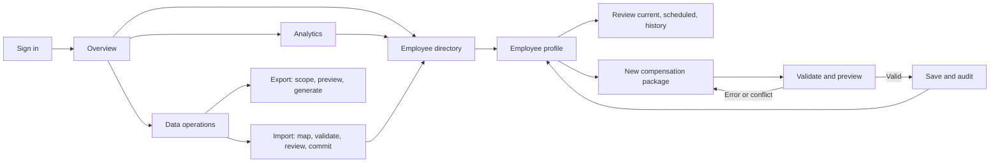

# ACME Salary Management — Product UX Specification

**Version:** 1.0 · **Date:** 2026-10-04 · **Status:** Proposed product design  
**Primary persona:** HR Manager · **Scale:** Approximately 10,000 employees across multiple countries  
**Source:** [`artifacts/requirements.md`](../artifacts/requirements.md), [`artifacts/db-schema-design.md`](../artifacts/db-schema-design.md), existing API and frontend

## 1. Product outcome and boundaries

The product gives authorized HR staff one place to find employees, maintain their effective-dated compensation packages, import spreadsheet data safely, and answer questions about pay across the organization. A successful HR Manager can find a person, understand their current and past pay, record a future change, and explain an aggregate figure without opening a spreadsheet.

The product manages **compensation commitments**, not actual payroll payments. It does not run payroll, transfer money, generate payslips, calculate tax or statutory deductions, determine allowance eligibility, or cover the rest of an HRMS. Analytics must not imply that a contractual amount was actually paid.

### Core user jobs

1. Find the right employee among 10,000 records.
2. See what compensation applies on a chosen date, including allowances and scheduled changes.
3. Record a complete new package without losing history or creating overlapping periods.
4. Bring existing spreadsheet data into the system with understandable validation and a safe commit.
5. Compare pay across countries, departments and roles using explicit currency and frequency rules.
6. Export an authorized, explainable snapshot and trace who changed or exported sensitive data.

### Design principles

- Show the employee, effective date, currency, and pay frequency wherever a salary amount appears.
- Make the current package visually distinct from scheduled and past packages.
- Preview consequences before a salary change or import is committed.
- Keep calculations explainable: every metric exposes its definition, population, date, currency, and exclusions.
- Apply access rules in the server and reflect them in the UI; a hidden button is not authorization.
- Prefer a clear correction path for data errors over silent coercion or partial saves.

## 2. Users, access, and privacy

| Role | Employee and pay view | Employee and pay edit | Import | Export | Analytics | Manage access, reference data, FX | Audit view |
|---|---|---|---|---|---|---|---|
| HR Admin | Assigned scope or all | Yes | Yes | Yes | Yes | Yes | Yes |
| HR Manager | Assigned scope | Yes, within scope | Yes, within scope | Yes, within scope | Yes, within scope | No | Yes, within scope |
| Read-only | Assigned scope | No | No | No | Yes, within scope | No | No |

An Admin assigns each user a country and optional department scope; an explicit **All countries** assignment supports central HR. The same scope applies to search results, direct employee URLs, dashboards, imports, exports, and audit records. Scope is evaluated against an employee's currently stored country and department, including when viewing older packages; this visibility rule is shown to Admins when assigning scope. A user outside scope sees an access-denied page without salary details. Disabled users lose access at the next authorization check. The UI never offers a public or employee self-service view.

Authentication uses the organization's approved sign-in method. After sign-in, show the user's name, role, assigned scope, and a sign-out control. Sessions expire; after expiry, return to sign-in and restore the intended page after successful reauthentication, without retaining sensitive form contents in a shared browser. Compensation values are never placed in URLs, browser titles, notification previews, or analytics telemetry. Exports require an explicit action, have short-lived authenticated download links, and are audited.

**Security gate:** The existing API has no authentication or authorization and attributes changes to a fixed development user. These proposed screens must not be exposed as a production salary product until the real caller, role, and scope are enforced on every salary endpoint.

## 3. Information architecture

```text
Sign in
└── Salary workspace
    ├── Overview
    ├── Employees
    │   ├── Directory
    │   ├── Employee profile
    │   │   ├── Current compensation
    │   │   ├── Scheduled compensation
    │   │   ├── Compensation history
    │   │   └── Change activity
    │   ├── Add employee
    │   └── New compensation package
    ├── Analytics
    │   ├── Summary and distribution
    │   ├── Country, department and role views
    │   └── Changes over time
    ├── Data operations
    │   ├── Imports
    │   └── Exports
    └── Administration (HR Admin)
        ├── Users and access
        ├── Allowance types
        ├── Countries, locations and departments
        ├── Currencies and FX rates
        └── Audit log
```

The persistent navigation contains **Overview, Employees, Analytics, Data operations**; Admin sees **Administration**. The current location appears in a page heading and breadcrumb. Page-level actions sit beside the heading. Filters are reflected in shareable URLs, except sensitive search terms if organizational policy forbids them. A link never embeds pay values.

## 4. Shared data and display rules

### 4.1 Dates and package state

- A package is **Current** when `effective_from ≤ selected date ≤ effective_to`, or `effective_to` is empty. It is **Scheduled** when its start is later and **Past** when its end is earlier. A gap means **No package effective on this date**; do not show the last salary as current.
- The default selected date is **Today in UTC**, matching the current API's date rule. Display the selected date and `UTC` beside it. A date picker allows read-only as-of inspection of stored packages. The organization may later adopt a different single effective-date policy through an explicit product decision.
- Show date ranges with inclusive wording: “1 Apr 2026–31 Mar 2027” or “From 1 Apr 2026”. Show a scheduled change separately even when it is the next day's change.
- A compensation change creates a full new package and allowance set. The previous package's pay and allowances remain in history; its end date may become the day before the new start.
- Standard new-change flow supports today or a future effective date. Retroactive corrections and in-place edits need a separate controlled workflow and are outside the initial release.

### 4.2 Money and frequency

- Display money with ISO currency code as well as localized symbol where useful, such as `₹1,250,000 INR / year`; use the currency's decimal places. Input uses human decimal units; storage and API use integer minor units. Never expose minor-unit integers as form values.
- Pay frequency is one of **Annual, Monthly, Hourly**. Show base and target variable pay in the package frequency. A missing variable value is “Not specified”; zero is “0”, not missing.
- Allowance currency always matches its package currency. Each allowance shows its own frequency. The first release uses Annual, Monthly, and Hourly, matching the current compensation API. The earlier database design mentions quarterly and one-time examples; those require an explicit model/API decision before appearing in the UI.
- Country's default currency can prefill a new package, but the user may select any supported currency. Changing currency never silently converts entered amounts; the form asks the user to confirm and re-enter amounts.

### 4.3 Analytics definitions

| Label in UI | Definition and interpretation |
|---|---|
| Employees in view | Distinct employees within access scope and active filters. The default analytics population is **Employed as of selected date**, derived from joining date and termination date; current status is a separate optional filter. Show the selected population and count. |
| Annualized base salary | Annual package base, or monthly base × 12. Hourly base is excluded until annual contracted hours or FTE is available. This is a commitment estimate, not actual cash paid. |
| Estimated annual base spend | Sum of annualized base salary for employees with an effective package on the selected date. Show excluded employee count and reasons. |
| Average / median base salary | Mean and median of the same annualized base values in the selected cohort; define median using the middle value or mean of two middle values. |
| Target variable pay | Separately displayed target amount; use the package frequency. It is not actual bonus paid. |
| Annualized allowances | Annual amounts plus monthly amounts × 12. Hourly allowances are excluded until annual hours are available. Show exclusions. |
| Indicative target compensation | Annualized base + target variable + annualized allowances for records where all included components can be normalized. Label as an estimate. |
| Salary distribution | Histogram of annualized base salary, with visible bin boundaries, employee count, currency, selected date, and exclusions. |
| Compensation changes | Count and before/after change in base pay for recorded package starts in the selected period. Show currency and frequency; only compute a percentage when comparison is meaningful. |

Country, department, and role breakdowns use employee attributes as stored **now**. The current data model does not preserve historical department, role, or location membership; the product must not label a historical grouping as the organization structure that existed then. A historical trend may show compensation versions over time, with this limitation in the methodology panel. Terminated employees remain searchable and in history. The default as-of cohort includes employees whose joining date is on/before the selected date and whose termination date is empty or on/after it; current status may further narrow the cohort if selected. This model cannot reconstruct separate employment spells after a rehire, which must be disclosed if such records exist.

For a single-currency cohort, use native currency. For a mixed-currency cohort, require a selected reporting currency and a dated, approved FX rate for every source currency. Show rate date, source, and conversion method in a **Methodology** panel and export metadata. Do not silently add mixed currencies. If a rate is missing, show the incomplete-conversion state, the affected currencies and employee count; exclude those records from the converted metric and label the result **Partial**. A total claimed as complete requires full coverage. FX rates and organization reporting currency need storage and admin workflows that do not yet exist.

### 4.4 Audit and terminology

“Compensation history” answers **what package applied when**. “Activity” answers **who made a change and when**. Every successful change, import, export, user-access modification, and reference/FX modification has a timestamp, actual actor, action, target, and relevant before/after values. Do not expose a raw JSON diff as the primary reading experience; provide a human-readable summary and a restricted technical detail view.

## 5. Screen specifications

### S01 — Sign in and access states

**Purpose:** Establish identity before any salary data loads.  
**Content:** Organization name, approved sign-in action, concise support path; no employee or salary preview.  
**States:** Signing in; wrong/expired credentials; disabled account; no assigned scope; session expired; service unavailable. Keep errors specific enough to recover without revealing whether an employee exists.  
**Completion:** Authorized user lands on Overview or the protected deep link they requested.

### S02 — Overview

**Purpose:** Give HR a trustworthy starting picture and direct routes to frequent work.  
**Content:** Selected as-of date, reporting currency, access scope, active filters; employees in view; estimated annual base spend; average/median; pending scheduled changes count; data-quality counts for employees without effective compensation, missing FX, and unresolved imports. Include last data refresh.  
**Actions:** Search employees; record change from an employee page; start import; open relevant analytics or data-quality list.  
**States:** Empty organization with “Import employees” action; partial metric with linked reasons; no permission for an action; metric load failure with retry. Cards never show an unlabeled mixed-currency amount.

### S03 — Employee directory

**Purpose:** Find an employee quickly at large scale.  
**Layout:** Search field above a server-paginated table; filter controls for country, department, role/job title, employment status, and optional location. Display active filter chips, result count, page size, and clear-all.  
**Columns:** Employee code, name, job title, department, country/location, status, current base pay with currency/frequency if authorized, current-package state. On narrow screens, each row becomes a compact card with the same essential identity and pay status.  
**Behavior:** Search name or employee code with debouncing, Enter to submit immediately, deterministic ordering, preserved filters while paging, and a URL that supports a return to the same list. Search is case-insensitive. A row opens the profile.  
**States:** First-use empty; zero results with clear filters; loading skeleton; error with retry; employees without a current package labeled explicitly. No client-side loading of all 10,000 rows.

### S04 — Employee profile

**Purpose:** Establish employee identity and full compensation context before any change.  
**Header:** Name, employee code, job title, department, location/country, status, join/termination dates where present; back to filtered directory.  
**Compensation area:** As-of date selector; prominent Current package card with base, target variable, currency, frequency, effective dates, and allowances; distinct Scheduled and History sections, each ordered by effective date. Each package can expand to show all fields and reason. Show activity separately.  
**Actions:** Record new package (authorized roles), export this employee's compensation (authorized roles), edit employee details (authorized roles).  
**States:** No compensation ever; no package effective on selected date; scheduled-only record; terminated employee; inaccessible employee; package load failure. Never substitute a scheduled or past package for current.

### S05 — Add or edit employee

**Purpose:** Maintain the minimum identity and organization data needed for compensation work.  
**Fields:** Employee code, first/last name, email, department, location (which determines country), job title, employment type, manager, joining date, optional termination date, status. Country is derived from selected location and visible before save.  
**Validation:** Unique employee code/email; required identity and references; termination date on/after join date; valid status transition; manager cannot be the same employee. Do not delete employee records to correct mistakes; edits are audited.  
**Completion:** Save returns to the profile; a newly created employee without compensation shows a clear “Add first package” next step.

### S06 — New compensation package

**Purpose:** Safely add the first package or version a change. Use a full page for reviewable context, not a small modal.  
**Context strip:** Employee name/code, current package and any scheduled packages, latest effective start, employee country, and selected currency.  
**Fields:** Effective-from date; base pay; optional target variable pay; pay frequency; currency; allowance rows (type, amount, frequency, remove); mandatory reason. Existing package values prefill a change as a starting point, including the full allowance set; the user can alter them before saving. First-package values start blank except country currency.  
**Calculated preview:** New package summary, annualized components when valid, and a before/after comparison in the same currency and frequency. If currency/frequency differs, show the values separately and do not fabricate a direct percentage. Show the prior package's new end date and which allowance types changed.  
**Actions:** Review change, then **Save package**; Cancel returns without a write. A confirmation panel names employee, effective date, total package, and reason. Only one submission is accepted; loading disables duplicate submits.  
**Validation:** Nonnegative monetary amounts, decimal precision for currency, distinct allowance types, supported frequency, nonblank reason, supported currency/type, valid date, no overlap, first package no earlier than join date, and later changes today/future and after the latest package start. Errors appear beside fields, summarized at top, with focus moved to the summary.  
**Conflict:** If another user saved a package meanwhile or the date overlaps, preserve entered values, show the latest saved package, explain the conflict, and allow review against the new state. Never silently overwrite history.  
**Completion:** Return to profile with the new package highlighted as Current or Scheduled, and show the activity entry.

### S07 — Analytics

**Purpose:** Answer organization pay questions without manual spreadsheet joins.  
**Controls:** As-of date; country, department, job title/role, status and location filters; currency mode (native for one currency, reporting currency for mixed cohorts); metric selector for annualized base and other clearly defined components. Preserve the chosen context across chart and table drill-downs.  
**Views:** Summary metrics; country/department/role table with employee count, sum, average, median; base-pay distribution; compensation changes over a selected period. Each chart has a corresponding data table and a **View employees** drill-down carrying filters.  
**Methodology:** Visible link beside each metric opens formula, inclusion rules, FX rate date/source, employee exclusions, and current-vs-historical organization attribute caveat. Export of a chart includes that metadata.  
**States:** No employees in cohort; partial FX coverage; hourly records excluded; no historical changes; chart/data load failure. Suppress a metric that cannot be computed honestly and give a path to fix its data.

### S08 — Import workspace

**Purpose:** Replace spreadsheet copy/paste with a controlled data migration and ongoing bulk update path.  
**Entry:** Choose **Employees**, **Compensation packages**, or **Both**; download a versioned CSV/XLSX template and example. The template describes dates, currency codes, frequencies, employee codes, allowance types, and required fields.  
**Wizard:** (1) Upload file and show name, size, and sheet; (2) map columns or confirm template; (3) validate references, data types, duplicate employees/rows, effective-period conflicts, scope, and dependencies; (4) review counts and before/after samples; (5) commit clean import; (6) result and audit reference. For combined import, match packages to employee codes from the same file or existing records.  
**Validation presentation:** Row number, column, entered value, plain-language reason, and fix guidance; filter by error type; downloadable error file. Warnings, such as a nondefault country currency, require explicit acknowledgement. No import commits while blocking errors remain.  
**Commit behavior:** The reviewed file and mapping are immutable during commit. Revalidate against current data immediately before saving. Show progress for long jobs; commit the validated batch atomically and report success or failure, including an idempotency/import ID so retry cannot duplicate packages. A failed commit does not leave a partly imported batch.  
**History:** Import list shows filename, type, actor, timestamp, scope, state, row counts, and result. Access to uploaded files and errors follows salary scope; retained files have an explicit retention policy.

### S09 — Export workspace

**Purpose:** Produce a controlled snapshot for authorized operations or analysis.  
**Controls:** Dataset (employee directory, current/as-of compensation, compensation history, or analytics table); as-of date or period; filters; included fields; CSV/XLSX; native currency or reporting currency where meaningful. Preview row count, scope, selected date, columns, exclusions, and FX method before requesting export.  
**Result:** For a small export, offer an authenticated download. For a large export, show a background job with status and expiry. The file includes a metadata sheet or companion header/document with generation time, actor, filters, as-of date, currency basis, FX rate date/source, and metric definitions. Escape spreadsheet formulas in user-controlled text.  
**States:** No matching records; export not allowed for role; partial FX coverage; generation failure and retry. Every request and completed download is attributable in the audit trail.

### S10 — Administration

**Users and access:** List users, invite/enable/disable, assign role and scope, review last access and changes. Show the effect of a scope change before saving; prevent removing the last active Admin.  
**Allowance types:** Create, rename, disable; show codes and descriptions. Disabling prevents future selection but preserves historical packages.  
**Reference data:** Manage supported countries, locations, departments and currencies. Codes used in historical records remain stable; avoid deletion when referenced.  
**Reporting currency and FX:** Set organization reporting currency, add/import dated rates with source, preview coverage and gaps, then publish rates. Changes must not silently rewrite stored compensation amounts.  
**Audit log:** Filter by actor, employee/entity, action and date; view human-readable before/after details, reason, import/export reference, and timestamp. Restrict sensitive details to the actor's scope and role.

## 6. End-to-end user flows



### F01 — First-time organization setup (HR Admin)

1. Sign in and set reporting currency and supported countries/currencies.
2. Create locations, departments, and allowance types; assign HR users their role and scope.
3. Add/import dated FX rates if cross-currency analytics are needed.
4. Open Imports, download a template, and import employee and compensation records.
5. Review quality alerts on Overview and resolve missing compensation or reference values.

**Outcome:** HR can search an authorized directory and see metrics with stated coverage. **Branch:** Missing FX does not block native-currency employee work; it marks mixed-currency analytics partial.

### F02 — Find and inspect an employee (HR Manager)

1. Enter name or code in directory search, optionally narrow by country/department/status.
2. Verify code, location and status in the result; open the profile.
3. Review Current package, allowances, Scheduled changes, and History; choose an as-of date if answering a historical question.
4. Open Activity when attribution or reason matters.

**Outcome:** Manager can state the package and period that answer the question. **Branches:** No current package shows a gap; a no-result search offers filter reset; an out-of-scope direct link shows access denied.

### F03 — Add an employee and first package (HR Manager)

1. Select **Add employee** and enter identity, organization, employment and location details.
2. Save; resolve unique-code/email or invalid-date errors in place.
3. From the new profile, select **Add first package**; enter salary, frequency, currency, effective date, allowances and reason.
4. Review and save; see Current or Scheduled based on the effective date.

**Outcome:** An employee may exist with no package, but is conspicuously flagged until pay is entered. **Branch:** First package cannot predate joining date.

### F04 — Record or schedule a compensation change (HR Manager)

1. From a profile, select **Record compensation change**.
2. Review the current/latest package; edit the prefilled full package and allowance set, effective date and reason.
3. Inspect before/after and the prior package's resulting end date; confirm.
4. Save once; return to the profile and verify the new package and activity entry.

**Outcome:** One complete version is added; past values remain visible. **Branches:** Same-day or future change becomes Current/Scheduled accordingly; an overlap or concurrent update returns to review with all user input preserved; changing currency requires amount reconfirmation.

### F05 — Understand compensation history (HR Manager or Read-only)

1. Open a profile, choose an as-of date or expand a past package.
2. Read base, target variable, allowance set, currency/frequency, effective period and recorded reason.
3. Open Activity for the actor and operation timestamp.

**Outcome:** User can distinguish the business effective date from when someone entered the change. **Branch:** If a seeded/imported historic package lacks a reason or actor, display “Not recorded” rather than guessing.

### F06 — Import spreadsheet data (HR Manager or Admin)

1. Choose import type and download the appropriate template.
2. Upload CSV/XLSX; map columns and run validation.
3. Correct blocking errors in the file and reupload; inspect changed/new row counts and samples.
4. Acknowledge warnings, review scope and totals, then commit.
5. Watch progress and open the result; inspect representative employee profiles and the import audit event.

**Outcome:** The batch is saved once and is traceable. **Branches:** A conflict discovered at commit returns a new error report and saves nothing; leaving the page does not cancel a submitted background job; duplicate retry links to the original result.

### F07 — Answer an organization pay question (HR Manager)

1. Open Analytics and select as-of date, cohort filters, metric and reporting currency.
2. Read the figure with employee count, exclusions and FX coverage; open Methodology.
3. Compare country/department/role rows or distribution; drill into the employee directory to investigate a segment.
4. Export the filtered table if authorized, with its definitions and conversion metadata.

**Outcome:** The answer can be reproduced from the same filters and date. **Branches:** Missing FX or hourly normalization produces a partial/inapplicable state, never a seemingly complete mixed-currency total.

### F08 — Export an authorized snapshot (HR Manager or Admin)

1. Choose dataset, fields, filters, as-of date/period and file format.
2. Review scope, approximate row count, currency basis and included sensitive columns.
3. Request export, wait or return to the job list, then download before expiry.

**Outcome:** A snapshot and its audit event share the same filters and generation time. **Branch:** Role/scope change before download blocks access to the prepared file.

### F09 — Manage access and investigate a change (HR Admin)

1. Open Users and access; assign a role and country/department scope to a colleague.
2. Save and verify the colleague's permission summary.
3. In Audit log, filter by employee, actor or date, inspect a compensation change's before/after and reason.
4. If access is revoked, disable the user or narrow their scope; subsequent requests honor the new assignment.

**Outcome:** Sensitive actions have a real human actor and a reviewable trail. **Branch:** The last active Admin cannot be disabled without another Admin in place.

## 7. Cross-screen interaction and content rules

### Feedback and recovery

- Preserve unsaved form input during field validation and server conflicts. Warn before leaving a dirty form.
- Use field-specific errors plus a summary for long forms and imports. Error text says what failed and how to fix it; never just “Invalid input.”
- Show a success message with employee code, effective date, and link to the saved package. Do not rely on a toast as the only evidence of success.
- Loading, empty, permission, partial-data, and service-error states are designed for every data surface. A service failure offers retry without showing stale salary as if current.
- Disable duplicate submissions, make job states resumable, and distinguish **validating**, **ready**, **committing**, **completed**, and **failed**.

### Accessibility and responsive behavior

- Meet WCAG 2.2 AA for keyboard access, visible focus, contrast, labels, error announcements, and screen-reader table/charts alternatives.
- Filters, date pickers, dialogs, tables, upload controls and the package review step are keyboard operable. Do not convey Current/Scheduled/Past or error severity through color alone.
- Use locale-aware number/date formatting, but keep unambiguous ISO codes for currency and export data. Provide a plain-text equivalent for abbreviations like `1.2M`.
- At narrow widths, keep search/filter/action access and employee identity visible; allow horizontal table scrolling only for dense comparison, with the first identifying column pinned where practical.

### Performance and scale targets

- Directory search, filtering and pagination run server-side with a stable sort; no 10,000-row browser fetch. Default 20 results, maximum 100 per page aligns with the current API.
- Overview and Analytics disclose calculation time and may use background jobs/cached aggregates; stale data must show its refresh timestamp.
- Bulk import/export runs asynchronously when large, exposes status, and survives navigation. The UI stays usable while jobs run.
- Validate derived metrics against source counts and show missing-data counts so a partial result is identifiable.

## 8. Acceptance checks for the UX

1. A Manager can locate an employee by partial name or code, combine filters, return from the profile, and retain the same result page.
2. A profile with past, current and future packages shows exactly one current package for an as-of date, and a gap shows none.
3. A package change previews the complete new allowance set and prior end date; after save, both versions and the real actor/reason are visible.
4. Invalid amounts, unsupported currencies/types, duplicate allowance types and overlapping dates produce actionable errors without partial writes.
5. Importing a file with a bad row yields a row-level report and no commit; a clean, reviewed file commits once and can be found in import history.
6. A mixed-currency total displays reporting currency, FX coverage and rate provenance; missing rates cannot look like a complete total.
7. Hourly employees are counted in the cohort but excluded with a visible count from annualized metrics until annual hours are available.
8. A Read-only user can inspect in-scope salary and analytics but cannot edit, import or export; an out-of-scope URL reveals no pay.
9. An authorized export includes date, scope, filters, field list and metric/FX methodology and appears in the audit log.
10. Keyboard and screen-reader users can complete the find → inspect → change flow, including validation recovery.

## 9. Product decisions and implementation gaps

This document specifies the **target product UX**, not the current UI. Today the React app is only a system-health page. The backend supports employee search/filter/pagination, compensation detail, and append-only package creation for local development. It lacks real sign-in, role/scope enforcement, employee maintenance, analytics, FX rates, import/export, administration, and most audit workflows. The current package API permits only Annual/Monthly/Hourly allowance frequency and no retrospective correction.

The following product choices need confirmation before their dependent feature is built:

| Decision | Proposed first-release rule | Why it matters |
|---|---|---|
| Authorization scope | Role plus assigned country/department; Admin can grant All countries | Determines visibility, exports, and aggregate populations. |
| Reporting currency and rates | Admin-configured currency; dated approved FX rates with source; no silent mixed-currency sums | Defines trustworthy org totals. |
| Hourly annualization | Exclude from annualized money metrics until contracted annual hours/FTE exists | Avoids invented salary spend. |
| Variable pay meaning | Treat stored value as target amount in package frequency, displayed separately from base | Actual bonus payout is unavailable. |
| Historical organization grouping | Use current employee attributes and label it; add org-attribute history if historical grouping is required | Current schema cannot reconstruct old departments/roles. |
| Import transaction | Revalidate and commit a reviewed batch atomically, with idempotent retry | Prevents partial migration and duplicates. |
| Effective-date time zone | Use UTC for Today and scheduled activation, matching the current API; show UTC in the UI | Prevents different users seeing different package states at day boundaries. |

These rules should be recorded in feature specs and tested as capabilities are implemented. In particular, analytics should not ship a “total salary spend” number until the exact population, normalization, and FX behavior above are implemented or explicitly revised.
